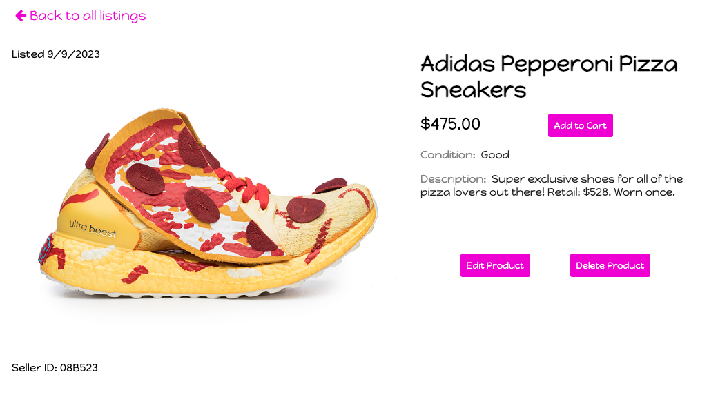
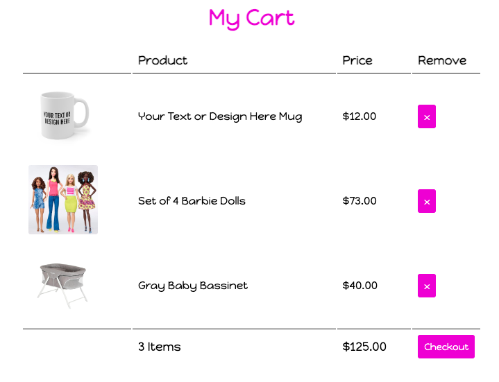

<!-- PROJECT LOGO -->
 

<h2 align="center">
    <a href="https://vibrant-village-6e72f0c47e7c.herokuapp.com/" target="_blank" rel="noopener noreferrer" >Mix It Up!</a>
</h2>

  

    MixItUp! is an e-commerce app that allows users to clear out the clutter from their homes and list items
    for sale they no longer need. Buyers can purchase items directly from sellers, cutting out the middleman!
  

<!-- TABLE OF CONTENTS -->

  
Table of Contents

  <ol>
    <li><a href="#app-images">App Images</a></li>
    <li><a href="#built-with">Built With</a></li>
    <li><a href="#getting-started">Getting Started</a></li>
    <li><a href="#next-steps">Next Steps</li>
  </ol>

## App Images

(<a href="#readme-top">back to top</a>)

## Built With

* Javascript
* React.js
* Node.js
* Express.js
* MongoDB / Mongoose
* HTML
* CSS

(<a href="#readme-top">back to top</a>)

## Getting Started

<h4>How to Use MixItUp!</h4>
<h5>Click <a href="https://vibrant-village-6e72f0c47e7c.herokuapp.com/" target="_blank" rel="noopener noreferrer" >here</a> to visit the site!</h5>
<ol>
    <li>Create an account to browse and list products.</li>
    <li>If you are looking to sell, create listings with your item's photo, title, condition, category, description, and price. Items can be edited by the seller and deleted when they are no longer available for sale.</li>
    <li>If you are looking to buy, browse listings and read the details of each item you're interested in buying. Add items to cart and checkout! Find previous orders on your Order History page.</li>
</ol>

(<a href="#readme-top">back to top</a>)

## Next Steps

<h4>In future versions, we hope to roll out the following features:</h4>
<ul>
    <li>Buyers can add products for sale to a list of favorites if they're not ready to buy today.</li>
    <li>Buyers can browse items by filtering listings by category.</li>
    <li>Buyers can search for specific products using a name or keyword search.</li>
    <li>Sellers can add multiple photos to their product listing.</li>
</ul>

(<a href="#readme-top">back to top</a>)
